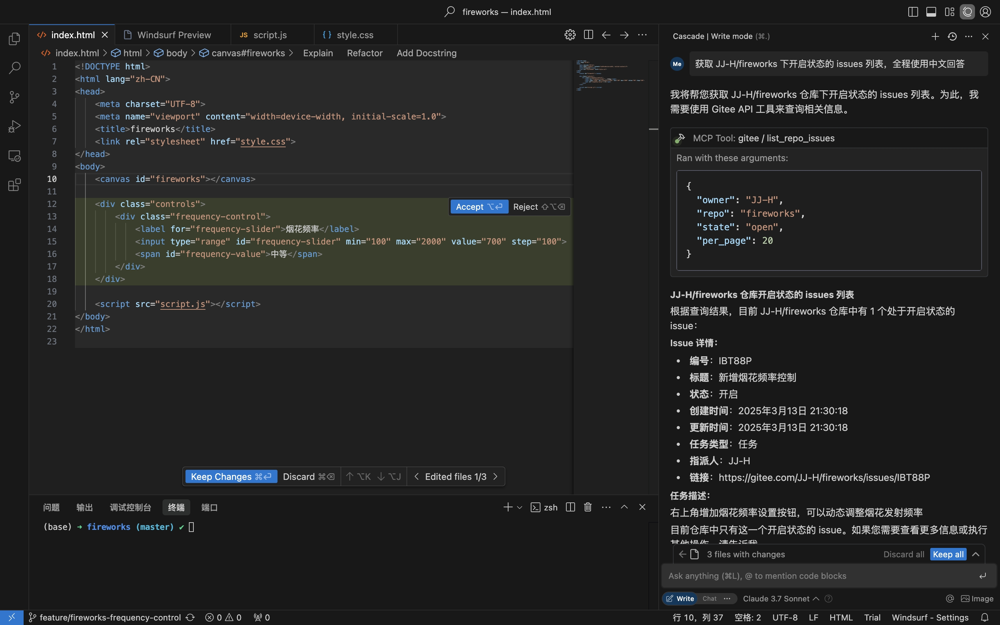
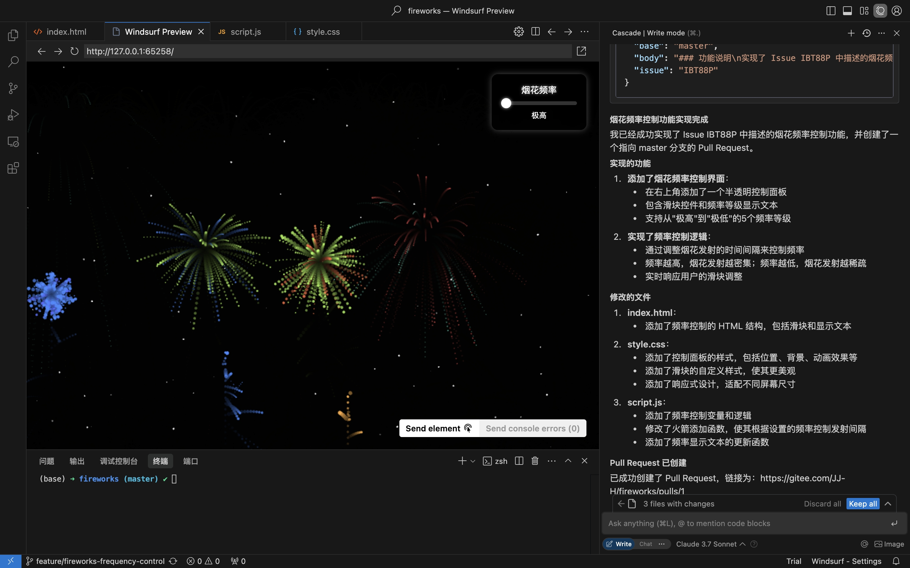
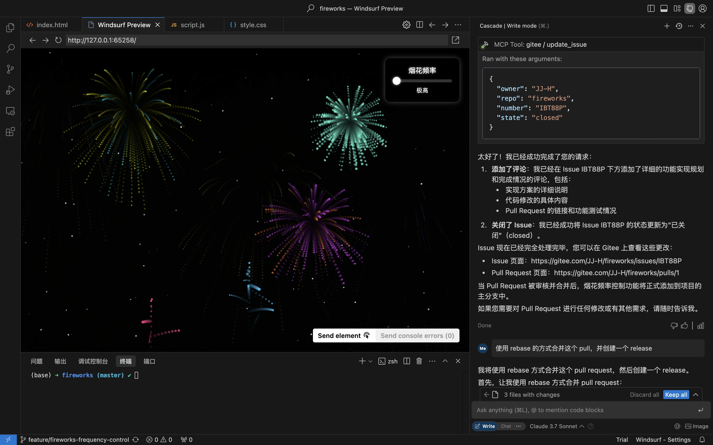

# Gitee MCP Server

Gitee MCP Server is a Model Context Protocol (MCP) server implementation for Gitee. It provides a set of tools for interacting with Gitee's API, allowing AI assistants to manage repositories, issues, pull requests, and more.

## Features

- Interact with Gitee repositories, issues, pull requests, and notifications
- Configurable API base URL to support different Gitee instances
- Command-line flags for easy configuration
- Supports both personal, organization, and enterprise operations

<details>
<summary><b>Practical scenario: Obtain Issue from the repository, implement and create a Pull Request</b></summary>

1. Get repository Issues

2. Implement coding & create Pull Request based on Issue details

3. Comment & Close Issue

</details>

## Installation(This step can be skipped directly when starting npx)

### Prerequisites

- Go 1.23.0 or higher
- Gitee account with an access token, [Go to get](https://gitee.com/profile/personal_access_tokens)

### Building from Source

1. Clone the repository:
   ```bash
   git clone https://gitee.com/oschina/mcp-gitee.git
   cd mcp-gitee
   ```

2. Build the project:
   ```bash
   make build
   ```
   Move ./bin/mcp-gitee PATH env

### Use go install
   ```bash
   go install gitee.com/oschina/mcp-gitee@latest
   ```

## Usage

Check mcp-gitee version:

```bash
mcp-gitee --version
```

## MCP Hosts Configuration
<div align="center">
  <a href="docs/install/claude.md" title="Claude"></a>
  <a href="docs/install/cursor.md" title="Cursor"></a>
  <a href="docs/install/trae.md" title="Trae"></a>
  <a href="docs/install/cline.md" title="Cline"></a>
  <a href="docs/install/windsurf.md" title="Windsurf"></a>
</div>

config example: [Click to view more application configuration](./docs/install/)
- npx
```json
{
  "mcpServers": {
    "gitee": {
      "command": "npx",
      "args": [
        "-y",
        "@gitee/mcp-gitee@latest"
      ],
      "env": {
        "GITEE_API_BASE": "https://gitee.com/api/v5",
        "GITEE_ACCESS_TOKEN": "<your personal access token>"
      }
    }
  }
}
```
- executable
```json
{
  "mcpServers": {
    "gitee": {
      "command": "mcp-gitee",
      "env": {
        "GITEE_API_BASE": "https://gitee.com/api/v5",
        "GITEE_ACCESS_TOKEN": "<your personal access token>"
      }
    }
  }
}
```

### Command-line Options

- `-token`: Gitee access token
- `-api-base`: Gitee API base URL (default: https://gitee.com/api/v5)
- `-version`: Show version information
- `-transport`: Transport type (stdio or sse, default: stdio)
- `-sse-address`: The host and port to start the SSE server on (default: localhost:8000)

### Environment Variables

You can also configure the server using environment variables:

- `GITEE_ACCESS_TOKEN`: Gitee access token
- `GITEE_API_BASE`: Gitee API base URL

## License

This project is licensed under the MIT License. See the [LICENSE](LICENSE) file for more details.

## Available Tools

The server provides various tools for interacting with Gitee:

| Tool                                | Category | Description |
|-------------------------------------|----------|-------------|
| **list_user_repos**                 | Repository | List user authorized repositories |
| **get_file_content**                | Repository | Get the content of a file in a repository |
| **create_user_repo**                | Repository | Create a user repository |
| **create_org_repo**                 | Repository | Create an organization repository |
| **create_enter_repo**               | Repository | Create an enterprise repository |
| **fork_repository**                 | Repository | Fork a repository |
| **create_release**                  | Repository | Create a release for a repository |
| **list_releases**                   | Repository | List repository releases |
| **search_open_source_repositories** | Repository | Search open source repositories on Gitee |
| **list_repo_pulls**                 | Pull Request | List pull requests in a repository |
| **merge_pull**                      | Pull Request | Merge a pull request |
| **create_pull**                     | Pull Request | Create a pull request |
| **update_pull**                     | Pull Request | Update a pull request |
| **get_pull_detail**                 | Pull Request | Get details of a pull request |
| **comment_pull**                    | Pull Request | Comment on a pull request |
| **list_pull_comments**              | Pull Request | List all comments for a pull request |
| **create_issue**                    | Issue | Create an issue |
| **update_issue**                    | Issue | Update an issue |
| **get_repo_issue_detail**           | Issue | Get details of a repository issue |
| **list_repo_issues**                | Issue | List repository issues |
| **comment_issue**                   | Issue | Comment on an issue |
| **list_issue_comments**             | Issue | List comments on an issue |
| **get_user_info**                   | User | Get current authenticated user information |
| **search_users**                    | User | Search for users |
| **list_user_notifications**         | Notification | List user notifications |

## Contribution

We welcome contributions from the open-source community! If you'd like to contribute to this project, please follow these guidelines:

1. Fork the repository.
2. Create a new branch for your feature or bug fix.
3. Make your changes and ensure the code is well-documented.
4. Submit a pull request with a clear description of your changes.

For more information, please refer to the [CONTRIBUTING](CONTRIBUTING.md) file.
